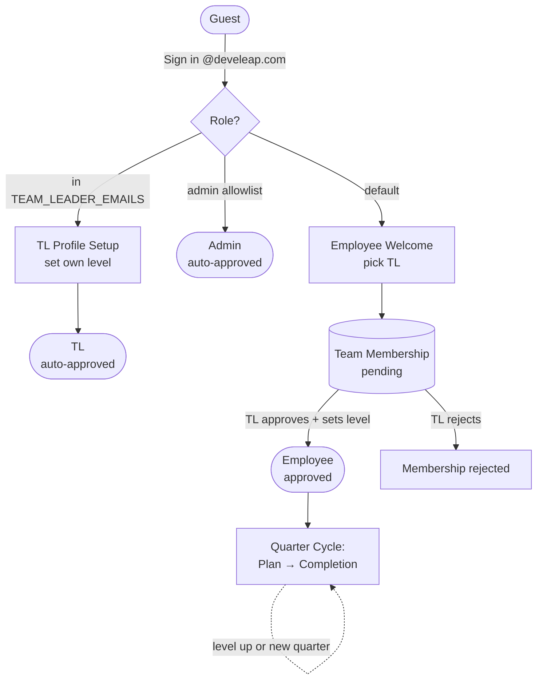
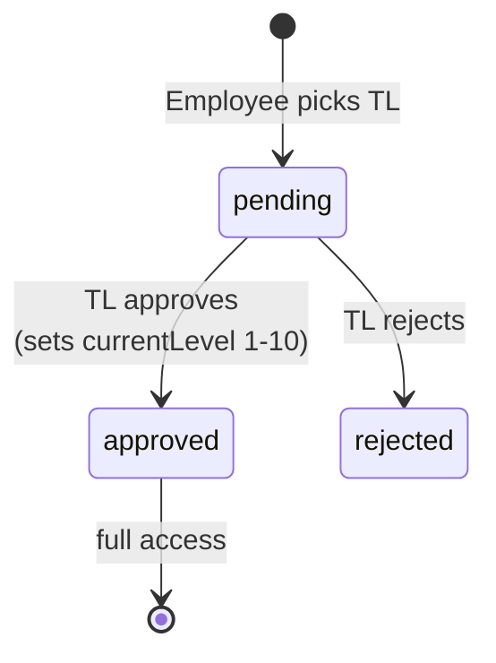
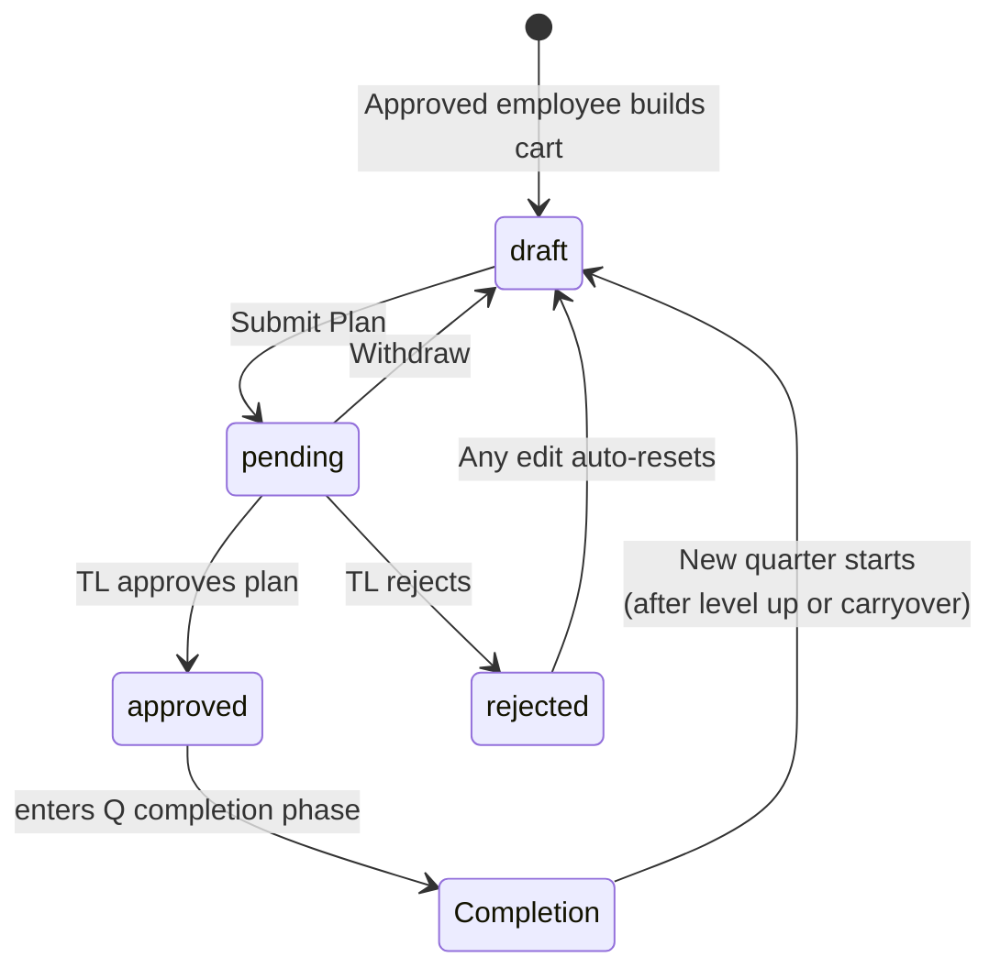
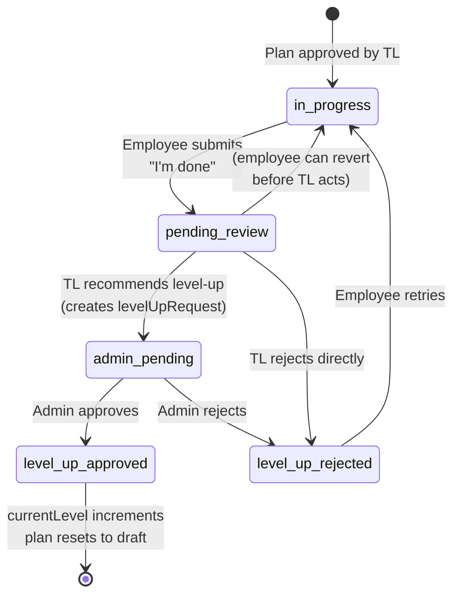
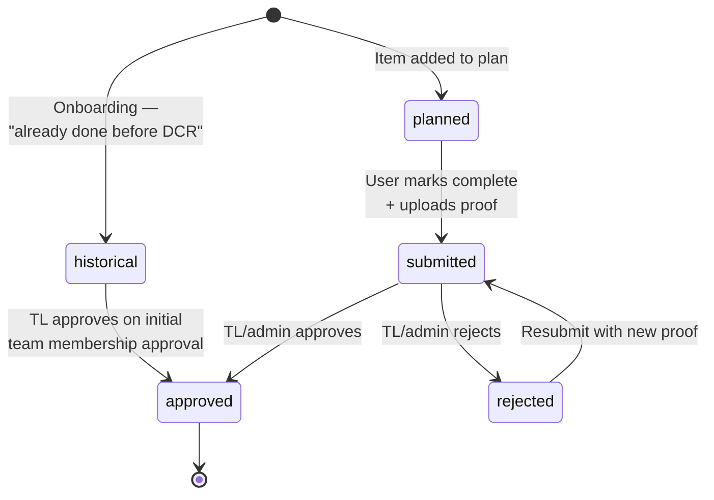
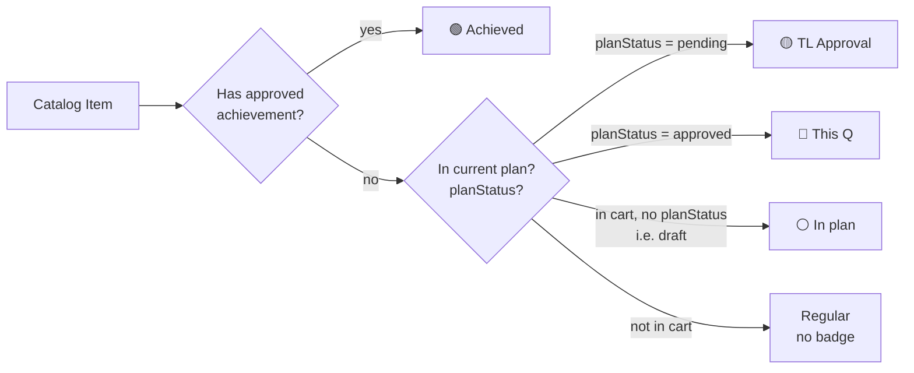
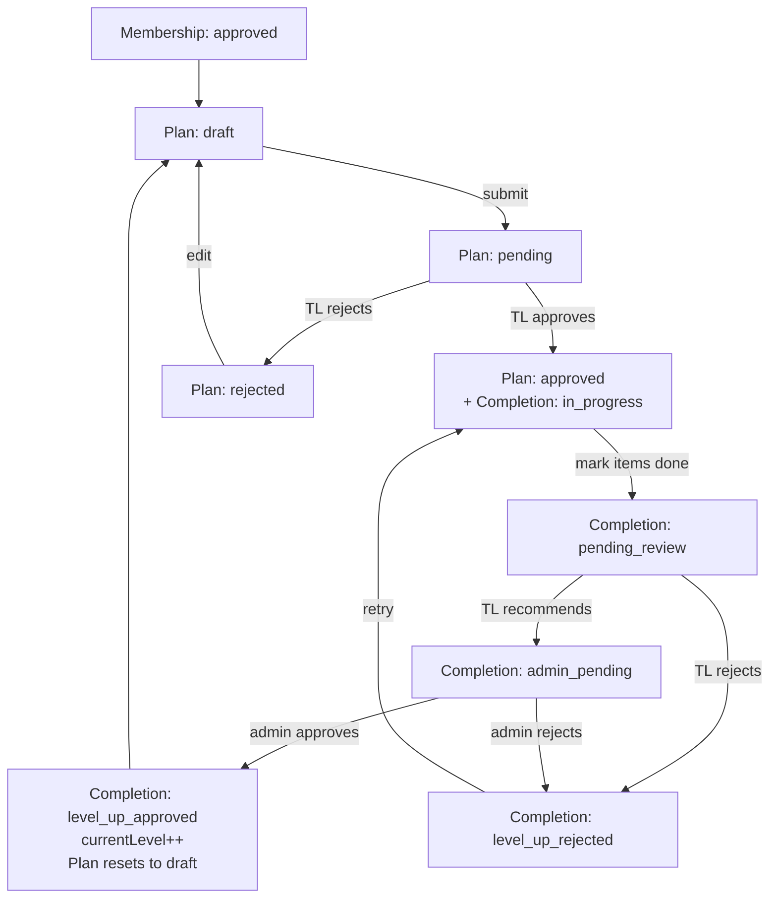

# DCR 2.0 — State & Flow Reference

This document maps every status machine in the app and how they cascade. All state lives in `src/data/types.ts` unless otherwise noted.

## User types (roles)

| Role | Source | Default approval |
|------|--------|------------------|
| Guest | not signed in | n/a |
| Employee | default for `@develeap.com` | needs TL approval |
| TL (team_leader) | listed in `src/data/teamLeaderEmails.ts` | auto-approved |
| Admin | admin allowlist in `useAuth.ts` | auto-approved |

---

## 1. Big picture — employee lifecycle across a quarter

---

## 2. Team membership approval — `ApprovalStatus`

`'pending' | 'approved' | 'rejected'`

TL and admin skip this — both auto-approved on first login.

---

## 3. Plan status — `PlanStatus`

`'draft' | 'pending' | 'approved' | 'rejected'`

The status of the quarterly plan itself (not completion). Lives on `UserPlan.planStatus`.

---

## 4. Q completion status — `CompletionStatus`

`'in_progress' | 'pending_review' | 'admin_pending' | 'level_up_approved' | 'level_up_rejected'`

Activates only **after** `planStatus === 'approved'`. Tracks "did the user actually do the work and do they level up?"

**Key rule:** TL alone can **never** set `level_up_approved`. The TL's "approve" button creates a `levelUpRequest` and routes to `admin_pending`. Only an admin can finalize a level-up. The TL **can** reject directly without involving admin.

---

## 5. Achievement status — `AchievementStatus`

`'historical' | 'planned' | 'submitted' | 'approved' | 'rejected'`

Per individual item record in the `achievements/` Firestore collection.

---

## 6. Card status — derived display state

Card statuses are **not stored** — they're computed each render from the other state machines. Logic in `src/components/CatalogPage/CatalogPage.tsx:414-453`.

### Top-left badges (mutually exclusive — user/plan state)

### Top-right badges (intrinsic item attributes — only when not achieved)

| Badge | Condition |
|-------|-----------|
| 🔴 Required | `item.required === true` |
| 🔷 Promoted | `item.promoted === true` && `!item.required` |

**Note:** `planStatus = rejected` does not get its own card badge — it falls through to "In plan" (because the check is `!planStatus && inCart`), and editing a rejected plan auto-resets it to `draft` anyway.

---

## 7. How it all stacks — one employee, one quarter

Three sequential gates: **membership → plan → completion**. Each has its own state machine; progression to the next requires the previous one to be in its `approved` terminal.

---

## Quick reference — type definitions

| Type | Values | File |
|------|--------|------|
| `UserRole` | `employee \| team_leader \| admin` | `types.ts:61` |
| `ApprovalStatus` | `pending \| approved \| rejected` | `types.ts:63` |
| `PlanStatus` | `draft \| pending \| approved \| rejected` | `types.ts:67` |
| `CompletionStatus` | `in_progress \| pending_review \| admin_pending \| level_up_approved \| level_up_rejected` | `types.ts:69` |
| `AchievementStatus` | `historical \| planned \| submitted \| approved \| rejected` | `types.ts:269` |
| `AchievementType` | `historical \| quarterly` | `types.ts:271` |
| `PendingApprovalType` | `initial \| quarterly` | `types.ts:65` |
